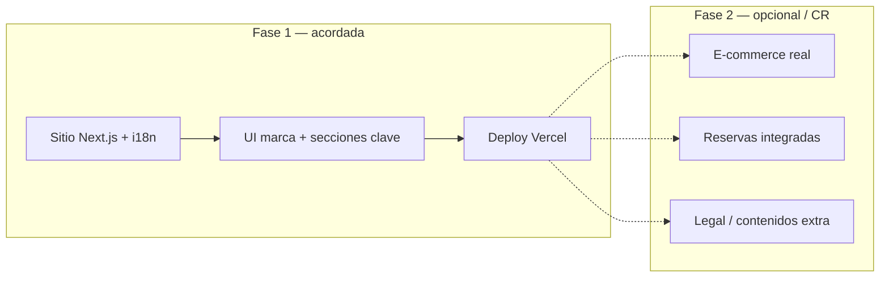

# NanaiCare — Project Charter

**Proyecto:** presencia web y evolución digital para NanaiCare (salón de belleza / facial wellness, Ámsterdam, Países Bajos).  
**Cliente / marca:** NanaiCare  
**Agencia / coordinación:** Sambalab  
**Desarrollo:** DGRcodex — Daniel García Rojas  

**Versión del documento:** 1.0  
**Fecha de referencia:** mayo 2026  

---

## 1. Propósito y visión

Definir **alcance, límites, responsables y condiciones económicas** del proyecto NanaiCare para alinear expectativas entre la clienta, Sambalab y el desarrollador, y servir como referencia única ante dudas de priorización o cambios de alcance.

**Visión digital:** una experiencia **móvil primero**, **profesional y cercana**, en **inglés, español y neerlandés**, que presente servicios, testimonios, recomendaciones de bienestar y un camino claro hacia la venta futura de productos de skincare.

---

## 2. Partes y roles

| Rol | Quién | Responsabilidad |
|-----|--------|-----------------|
| Clienta / decisión de negocio | NanaiCare | Contenidos finales, tono, legal, precios, políticas, agenda, dominio y pagos acordados. |
| Coordinación | Sambalab | Interlocución, priorización con la clienta, entregables de comunicación. |
| Implementación técnica | DGRcodex (Daniel García Rojas) | Arquitectura Next.js, i18n, diseño UI acorde a marca, despliegue y documentación técnica básica. |

---

## 3. Alcance incluido (resumen)

- Sitio **Next.js** desplegable (p. ej. **Vercel**), estructura **escalable**.
- **Internacionalización** (EN / ES / NL) con rutas por idioma.
- **Identidad visual** acorde a la paleta y tipografías acordadas (Oswald / Quicksand).
- Secciones de **inicio**: hero, servicios (layout tipo bento), testimonios, bienestar, avance de **tienda** (teaser / waitlist sin pasarela de pago hasta fase posterior).
- **Charter / presupuesto** en documentación y página interna de transparencia para el equipo (opcional en producción según decisión de la clienta).

---

## 4. Fuera de alcance (por esta fase, salvo acuerdo escrito aparte)

- Integración completa de **pasarela de pago** y **logística** de e‑commerce.
- **CRM**, reservas en tiempo real conectadas a un calendario externo, o app nativa iOS/Android.
- **Redacción legal** (AVG/GDPR, cookies, términos): plantillas base sí; revisión jurídica especializada no.
- **Producción fotográfica** en estudio (se asumen imágenes provistas o stock acordado).
- Mantenimiento **24/7** o SLA enterprise no contratado explícitamente.

---

## 5. Límites y gestión de cambios

- Cualquier funcionalidad **no listada** en el alcance o que implique **nuevo proveedor** (pagos, envíos, ERP) se cotiza como **fase 2** o **change request**.
- Los cambios que **invaliden trabajo ya entregado** (p. ej. rediseño total fuera de criterios aprobados) pueden implicar **revisión de plazo y coste**.
- La **fuente de verdad** del copy de negocio son los textos validados por la clienta; traducciones asistidas pueden refinarse en rondas acotadas.

---

## 6. Presupuesto y supuestos (EUR)

| Concepto | Importe |
|----------|--------:|
| Honorarios / desarrollo (base) | **500,00 €** |
| IVA (referencia **21 %** sobre la base de 500 € en NL; **confirmar en factura**) | **105,00 €** |
| Dominio (estimación **30 €** / **3 años**, según proveedor) | **30,00 €** |
| **Total orientativo** | **635,00 €** |

**Nota:** el IVA exacto y el coste final del dominio dependen del proveedor de dominio y del tratamiento fiscal aplicable; esta tabla es la **referencia acordada** para planificación.

---

## 7. Hitos de pago (50 % + 50 %)

| Hito | % del total | Importe (sobre 635 €) | Estado |
|------|------------:|----------------------:|--------|
| **Primera mitad** | 50 % | **317,50 €** | Parcialmente pagada |
| **Segunda mitad** | 50 % | **317,50 €** | Pendiente al cierre de entrega acordada |

**Pagos recibidos (referencia):**

- A la fecha de redacción: **130,00 €** abonados.
- **Pendiente para completar la primera mitad (317,50 €):** **187,50 €** — objetivo: **abono en la misma semana** según acuerdo verbal entre las partes.

**Segunda mitad:** quedará **pendiente de facturación / pago** según el calendario acordado al validar el entregable de primera fase.

---

## 8. Diagrama de alcance (vista rápida)

---

## 9. Brief de clienta (contenido del documento enviado)

> **Instrucción:** aquí debe pegarse **literal o resumido** el documento que envió la clienta (texto, bullets, tono, público, servicios concretos, restricciones).  
> Hasta incorporar ese archivo, el sitio muestra un **resumen operativo** alineado con lo ya construido (Amsterdam, trilingüe, facial wellness, testimonios, bienestar, teaser de tienda).

---

## 10. Cierre

Este charter resume **límites, coste orientativo y reparto de roles**. Cualquier modificación sustancial debe quedar **por escrito** (correo o anexo firmado) entre Sambalab, la clienta y el desarrollador.

**Firmas (opcional en PDF impreso)**

| NanaiCare (cliente) | Sambalab | DGRcodex |
|---------------------|----------|----------|
| __________________ | ________________ | ________________ |
