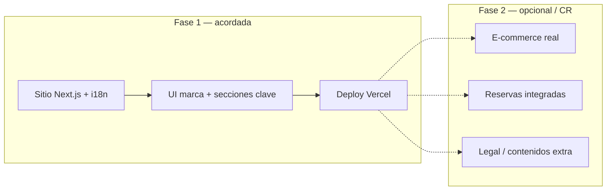

# NanaiCare — Project Charter

**Proyecto:** presencia web y evolución digital para NanaiCare (salón de belleza / facial wellness, Ámsterdam, Países Bajos).  
**Cliente / marca:** NanaiCare  
**Agencia / coordinación:** Sambalab  
**Desarrollo:** DGRcodex — Daniel García Rojas  

**Versión del documento:** 1.0  
**Fecha de referencia:** mayo 2026  

---

## 1. Propósito y visión

Definir **alcance, límites, responsables y condiciones económicas** del proyecto NanaiCare para alinear expectativas entre la clienta, Sambalab y el desarrollador, y servir como referencia única ante dudas de priorización o cambios de alcance.

**Visión digital:** una experiencia **móvil primero**, **profesional y cercana**, en **inglés, español y neerlandés**, que presente servicios, testimonios, recomendaciones de bienestar y un camino claro hacia la venta futura de productos de skincare.

---

## 2. Partes y roles

| Rol                           | Quién                          | Responsabilidad                                                                                  |
| ----------------------------- | ------------------------------ | ------------------------------------------------------------------------------------------------ |
| Clienta / decisión de negocio | NanaiCare                      | Contenidos finales, tono, legal, precios, políticas, agenda, dominio y pagos acordados.          |
| Coordinación                  | Sambalab                       | Interlocución, priorización con la clienta, entregables de comunicación.                         |
| Implementación técnica        | DGRcodex (Daniel García Rojas) | Arquitectura Next.js, i18n, diseño UI acorde a marca, despliegue y documentación técnica básica. |

---

## 3. Alcance incluido — Fase 1 (resumen)

- Sitio **Next.js** en **Vercel**, **EN / ES / NL**, paleta **Sacred Sound**, tipografías Oswald / Quicksand.
- Significado **Nanai**, dirección de **logo**, secciones cálidas (no plantilla básica).
- Página **/treatments** con catálogo completo (corporales, faciales, paquetes, suscripciones).
- **Políticas** (50 % depósito, 24 h, reagendar ×2, transferible, cancelación Nanai).
- Inicio: testimonios, bienestar, teaser tienda; **roadmap fase 2** visible.
- **Charter** (MD + `/charter`) con presupuesto y hitos de pago.

---

## 4. Fase 2 y fuera de alcance (salvo acuerdo escrito)

**Fase 2 (del brief de la clienta):** agenda editable, gráficos mensuales/anuales (tratamientos y recaudación), métodos de pago, ficha de salud y estética online.

**No incluido salvo nuevo presupuesto:** e‑commerce operativo, apps nativas, CRM complejo, SLA 24/7, revisión legal especializada, fotografía de estudio a medida.

---

## 5. Límites y gestión de cambios

- Cualquier funcionalidad **no listada** en el alcance o que implique **nuevo proveedor** (pagos, envíos, ERP) se cotiza como **fase 2** o **change request**.
- Los cambios que **invaliden trabajo ya entregado** (p. ej. rediseño total fuera de criterios aprobados) pueden implicar **revisión de plazo y coste**.
- La **fuente de verdad** del copy de negocio son los textos validados por la clienta; traducciones asistidas pueden refinarse en rondas acotadas.

---

## 6. Presupuesto y supuestos (CLP — pesos chilenos)

| Concepto                                                       | Importe  |
| -------------------------------------------------------------- | -------- |
| Honorarios / desarrollo (base)                                 | **$500** |
| IVA (**19 %** sobre la base de $500; **confirmar en factura**) | **$95**  |
| Dominio (estimación **$30** / **3 años**, según proveedor)     | **$30**  |
| **Total orientativo**                                          | **$625** |

**Nota:** montos en **pesos chilenos (CLP)**. El IVA (19 %) y el coste final del dominio dependen del proveedor y del tratamiento fiscal aplicable; esta tabla es la **referencia acordada** para planificación.

---

## 7. Hitos de pago (50 % + 50 %)

| Hito              | % del total | Importe (sobre $625) | Estado                                  |
| ----------------- | ----------- | -------------------- | --------------------------------------- |
| **Primera mitad** | 50 %        | **$312,50**          | Parcialmente pagada                     |
| **Segunda mitad** | 50 %        | **$312,50**          | Pendiente al cierre de entrega acordada |

**Pagos recibidos (referencia):**

- A la fecha de redacción: **$130** abonados.
- **Pendiente para completar la primera mitad ($312,50):** **$182,50** — objetivo: **abono en la misma semana** según acuerdo verbal entre las partes.

**Segunda mitad:** quedará **pendiente de facturación / pago** según el calendario acordado al validar el entregable de primera fase.

---

## 8. Diagrama de alcance (vista rápida)

---

## 9. Brief de clienta (Nanai Care — documento integrado)

**Nombre:** Nanai Care  

**Significado:** *Nanai* (quechua) — caricia muy tierna con la que se trata de calmar un dolor o una pena.

**Logo:** rostro de mujer con una mano en la cabeza, encerrado en una circunferencia; el nombre puede ir dentro o debajo (tres opciones en la web: isotipo, horizontal, apilado).

**Paleta:** Sacred Sound (`#FFFFFF`, `#F1D8D8`, `#CBAEAE`, `#B4AA86`, `#464C50`).

**Web:** [www.nanaicare.com](http://www.nanaicare.com) — página **amigable, intuitiva, cálida, coherente; no básica**.

### Fase 1 (esta entrega — sitio público)

- Historia de Nanai, identidad, EN / ES / NL.
- Pestaña / página de **tratamientos** (corporales, faciales, paquetes, suscripciones).
- **Políticas** de reserva y pago (texto acordado).
- Testimonios, bienestar, teaser tienda; charter y presupuesto.

### Fase 2 (brief — presupuesto aparte)

- Agenda fácil de rellenar y corregir.
- Gráficos de tratamientos por **mes** y **año**, y de **recaudación**.
- **Metodologías de pago** integradas.
- **Ficha de salud y estética** online.

### Políticas de cancelación y pago

- Pago por adelantado: **50 %** del tratamiento (depósito).
- Si no avisa con **24 h** de antelación: **no hay devolución** del 50 % del depósito.
- Si no puede asistir: puede **reagendar hasta 2 veces** o la cita es **transferible**.
- Cancelación por **NanaiCare:** reagendar o **devolución** del dinero.

### Catálogo de tratamientos (lista de la clienta)

**Corporales:** Stress Release (60/90 min), Deep Tissue (60/90), Hot Stones (60), Indian Head (50), Pregnancy (60), Lymphatic (60), Energizing Leg Ritual (45).

**Faciales:** Deep Cleansing (120), Sensitive Nanai Care (60), Lymphatic Nanai Detox, Post Acne (90), Microneedling with peptides, Men's Facial, Clear Skin, Summer Glow, Nanai Signature Care, Energizing Facial.

**Paquetes:** Primavera/Verano, Otoño/Invierno, Legs & Head, Legs & Face.

**Suscripciones:** 1 mes, 6 meses.

*(Listado completo en la ruta `/treatments` del sitio.)*

---

## 10. Cierre

Este charter resume **límites, coste orientativo y reparto de roles**. Cualquier modificación sustancial debe quedar **por escrito** (correo o anexo firmado) entre Sambalab, la clienta y el desarrollador.

**Firmas (opcional en PDF impreso)**

| NanaiCare (cliente) | Sambalab         | DGRcodex         |
| ------------------- | ---------------- | ---------------- |
| __________________  | ________________ | ________________ |

